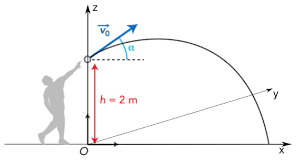

# TP1 : Introduction aux Fondamentaux de la Programmation en Python

⏰ Date de remise le 2 février à 23:59:00 sur moodle

❗Important: **Lors de la remise , créer un fichier .zip nommé LXX-YY-TP2.zip où XX est le numéro de votre section de laboratoire et YY le numéro de votre équipe**

## Introduction
Bienvenue dans le premier travail pratique de votre parcours d'apprentissage en programmation Python ! Ce TP est conçu pour vous guider à travers les concepts fondamentaux de la programmation. En explorant divers scénarios captivants, vous apprendrez à manipuler des variables, à comprendre différents types de données, à utiliser des opérateurs et à construire des expressions. Vous découvrirez également comment les chaînes de caractères fonctionnent en Python et comment les structures de contrôle telles que les instructions 'if' peuvent influencer le flux d'exécution de vos programmes. Chaque exercice est conçu pour renforcer votre compréhension et votre maîtrise des bases de la programmation, vous préparant ainsi à des défis plus complexes dans le futur. 

**Vous disposez d'un fichier de test qui permet de valider la complexion de vos résultats. Assurez vous de le rouler après chaque exercice!**

## 01. Bonjour 
Le programme le plus simple en Python est celui qui écrit dans la console la phrase `Bonjour`. Pour cet exercice, vous devez :

**Exemple :**

| Sortie | Entrée |
|:------|:-------|
| Veuillez entrer votre nom complet : | Mark Doe |
| Veuillez entrer votre âge : | 20 |
| Bonjour Mark Doe | |
| Vous êtes né(e) en 2005 | |

## 02. Le Système Énergétique de Stark Industries

En tant qu'ingénieur chez Stark Industries, vous avez été chargé de développer un nouveau système de surveillance pour les réacteurs Arc. Ce système doit non seulement afficher le niveau actuel de charge de la batterie, mais aussi alerter en cas de charge anormale, pour prévenir tout risque de surcharge ou de défaillance énergétique. Vous devez créer un système d'alerte qui indique visuellement le niveau de charge de la batterie et affiche un message d'erreur si la charge est en dehors de la plage normale (0 à 100%).

**Consignes :**
1. Demandez à l'utilisateur d'entrer le niveau de charge actuel de la batterie (en pourcentage).
2. Si le niveau de charge est entre 0 et 100%, affichez une représentation graphique de la charge de la batterie. Chaque barre représente 10% de charge, et le pourcentage doit être arrondi à la dizaine la plus proche pour déduire le nombre de barres. Utilisez le caractère suivant: `❚`.
3. Si le niveau de charge est négatif ou supérieur à 100%, affichez un message d'erreur.

**Note :** Pour faciliter la création de la barre de progression, utilisez l'opérateur de multiplication sur les chaînes de caractères. Pour plus d'informations sur cette fonctionnalité, consultez cette [documentation](https://www.geeksforgeeks.org/create-multiple-copies-of-a-string-in-python-by-using-multiplication-operator/).

**Exemples :**

| Sorties |  Entrées  |
|:------|:-----------|
| Entrez le niveau de charge actuel de la batterie :  | 0 | 
| [&nbsp;&nbsp;&nbsp;&nbsp;&nbsp;&nbsp;&nbsp;&nbsp;&nbsp;&nbsp;] 0% |  |

| Sorties |  Entrées  |
|:------|:-----------|
| Entrez le niveau de charge actuel de la batterie : | 12 | 
| [❚&nbsp;&nbsp;&nbsp;&nbsp;&nbsp;&nbsp;&nbsp;&nbsp;&nbsp;] 12%  | |

| Sorties |  Entrées  |
|:------|:-----------|
| Entrez le niveau de charge actuel de la batterie :  | 68 | 
| [❚❚❚❚❚❚❚&nbsp;&nbsp;&nbsp;] 68% |  |

| Sorties |  Entrées  |
|:------|:-----------|
| Entrez le niveau de charge actuel de la batterie :  | 123 | 
| Erreur : niveau de charge invalide. |  |

## 03. Équation quadratique
Dans cet exercice, vous devez résoudre une équation quadratique de la forme \(a^2x + bx + c\). Le programme commence en demandant à l'utilisateur de saisir la valeur des variables `a`, `b` et `c`. Il suffit de compléter la fonction `resoudreEquation()`.

## 04. Calculateur de temps
Dans cet exercice vous devez convertir un nombre de secondes en nombres d'années, semaines, jours, heures, minute et secondes. Par exemple, si l'utilisateur rentre '633323104' secondes, votre programme devra renvoyé 20 années, 4 semaines, 2 jours, 3 heures, 5 minutes et 4 secondes. Vous pouvez créer d'autres variables pour vous aider.

PS: On considère qu'une année est composée exactement de 365 jours !

## 05. Jeu olympique
Afin de prévoir correctement les dimensions possibles de la zone d'atterrissage de l'épreuve du lancer de poids, le comité vous demande de créer un script permettant de calculer la distance maximale en `x` d'une boule lancée par un athlète en fonction de sa vitesse initiale et de l'angle depuis laquelle elle est lancée.
L'image suivante vous montre comment ce poids sera lancé : 

Vous pouvez assumer que la boule sera toujours lancée à une hauteur de 2m et ne se déplacera pas dans l'axe des `y`. 

Vous pouvez utiliser la formule de portée d'un projectile afin de faire ce calcul:  
$$D = \frac{vitesse^2 \times \sin(2 \times angle)}{g}$$
- g = $9.8m/s^2$

Consignes:  

- Demander la vitesse initiale de la boule
- Demander l'angle de lancement
- Afficher la distance maximale en `x` (en mètres) **Arrondie à 2 chiffres après la virgule**

**Note**: Vous pouvez lire un exemple pour la fonction sin [ici](https://www.w3schools.com/python/ref_math_sin.asp) ! Faites attention à l'unité que prends la fonction sinus en paramètres.

Exemple:

| Sorties | Entrées |
|:-|:-|
| Vitesse initiale (en m/s): | 20.5 |
| Angle de lancer (en degrés): | 30 |
| Distance parcourue: 37.14m |

